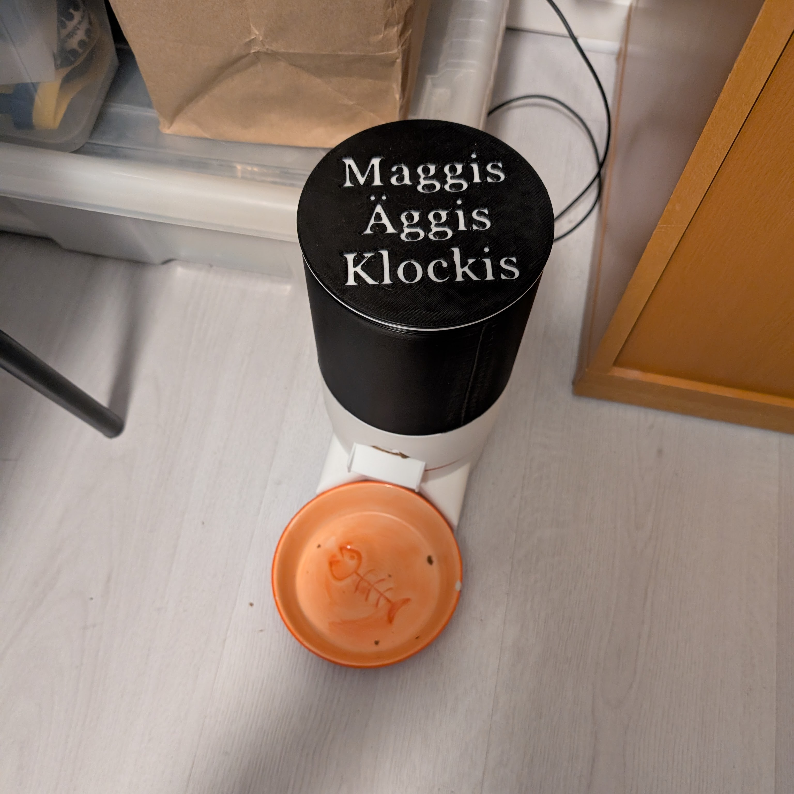
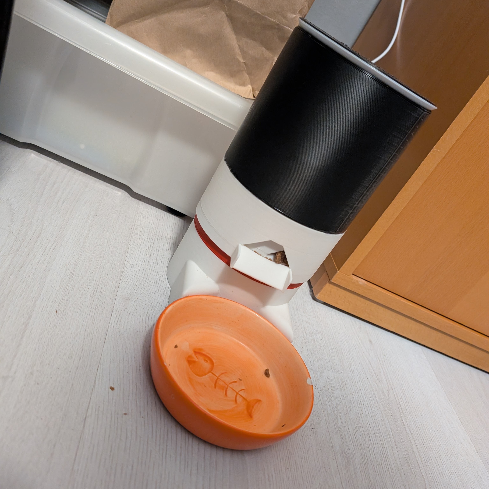

# Pet Feeder
DIY project for feeding my cat.

I'm using a Adafruit Trinket 5V with a MG90S micro servo.

To activate the pet feeder I'm using automation in the Philips Hue app to start a smart plug.
This way I can manually feed the cat earlier if I want to, or adjust the amount of feedings per day.

